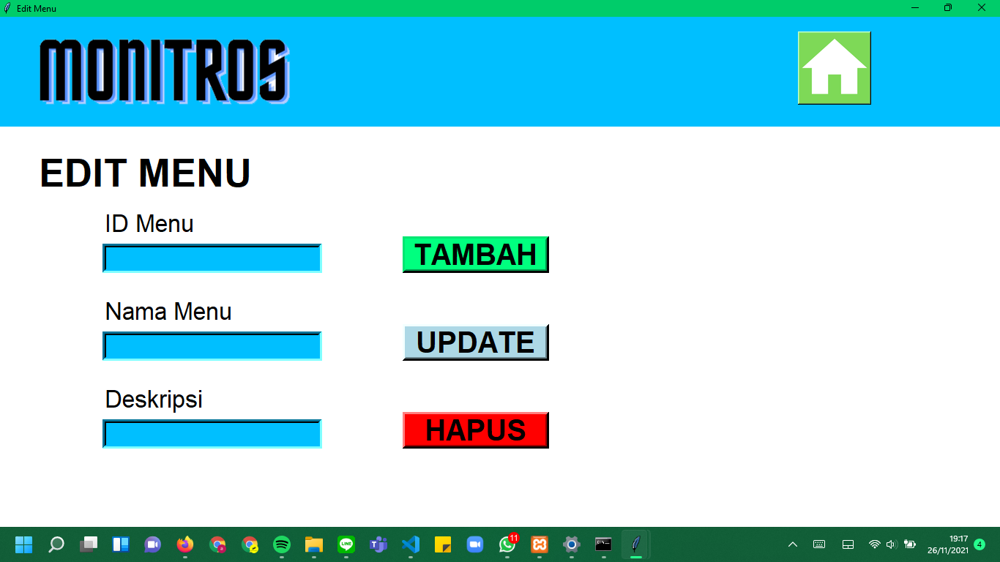

# IF3152-2021-G01-MONITROS

# PENJELASAN SINGKAT
Aplikasi 'MONITROS' adalah sebuah aplikasi manajemen sistem di restoran HeySteak Pekanbaru, yang memiliki 3 fitur utama:
- DAFTAR MENU (Termasuk dengan Edit Menu)
- DAFTAR PERALATAN (Termasuk dengan Edit Peralatan)
- TO-DO LIST (Termasuk dengan Edit To-do List). 

# CARA MENJALANKAN APLIKASI
- Buka directory 'src' dari folder yang telah diunduh dari repository if3152-2021-g01-monitros.
- Jalankan 'start.py' untuk menjalankan aplikasi.

# DAFTAR MODUL YANG DIIMPLEMENTASI
## LOGIN/REGISTER
Penanggung Jawab: Rahmat Fabhian Aminuddin

NIM: 18219055

## DAFTAR/EDIT PERALATAN
Penanggung Jawab: Kevin Kencana

NIM: 18219050

## DAFTAR/EDIT MENU
Penanggung Jawab: Fadli Naufal Rahman

NIM: 18219043

## TODOLIST 
Penanggung Jawab: Aindrea Rayhan Supriatno

NIM: 18219034

# DAFTAR TABEL BASIS DATA

## LOGIN/REGISTER
| Username | Password | Nama_lengkap | Nomor_HP | Alamat | Role |
| -        | -        | -            | -        | -      | -    |
| abhifabhian    | abhi        | abhi fabhian    |     213123 | Tangerang  | Owner    |
| arga34         | arga        | Arga Aminuddin  |   21921782 | Tangerang  | Karyawan |
| brunofernandes | united4life | Bruno Fernandes | 2147483647 | Manchester | Karyawan |

## DAFTAR/EDIT PERALATAN
| IDPeralatan | Nama_Peralatan | Tipe_Peralatan | Jumlah_Ideal | Jumlah_Peralatan | Kondisi         |
| -        | -        | -            | -        | -      | -    |
|           1 | Piring         | AlatMakan      |          200 |              170 | Butuh Beli Baru |
|           2 | sdasd          | dasdasd        |           12 |               11 | sadsad          |
|           3 | Garpu          | AlatMakan      |          100 |               70 | Butuh Beli Baru |
|           4 | Sumpit         | AlatMakan      |          100 |               90 | Aman            |
|           5 | MangkokM       | AlatMakan      |          150 |              145 | Aman            |
|           6 | Burner         | AlatMeja       |           15 |               15 | Aman            |
|           7 | Tong           | AlatMakan      |           30 |               30 | Aman            |
|           8 | Gunting        | AlatMakan      |           15 |               15 | Aman            |
|           9 | Gelas          | AlatMakan      |           80 |               75 | Aman            |
|          10 | Pitcher        | AlatWaiter     |           10 |                9 | Aman            |
|          11 | Sapu           | AlatKebersihan |           10 |               10 | Aman            |
|          12 | Pel            | AlatKebersihan |           10 |               10 | Aman            |
|          13 | Kain Lap       | AlatKebersihan |           20 |               14 | Butuh Beli Baru |
|          14 | Kotak Tissue   | AlatMeja       |           45 |               20 | Butuh Beli Baru |
|          15 | Condament      | AlatMeja       |           30 |               29 | Aman            |
|          16 | Tong Sampah    | AlatMeja       |            6 |                6 | Aman            |
|          17 | Tray           | AlatWaiter     |            8 |                8 | Aman            |

## DAFTAR/EDIT MENU
| IDMenu | Nama_Menu   | Deskripsi              |
| -        | -        | -            |
|      1 | Nasi goreng | Isi sosis, ayam, bakso |

## TODOLIST
## LOGIN/REGISTER
| IDPekerjaan | Username       | Role     | Nama_Pekerjaan  | Deskripsi                                  | Status          |
| -        | -        | -            | -        | -      | -    |
|           1 | arga34         | Karyawan | Rekap Penjualan | Mengecek ulang dan merekap hasil penjualan | Belum Dilakukan |
|           2 | brunofernandes | Karyawan | Update stok     | Hitung dan validasi stok di gudang         | Sudah dilakukan |
