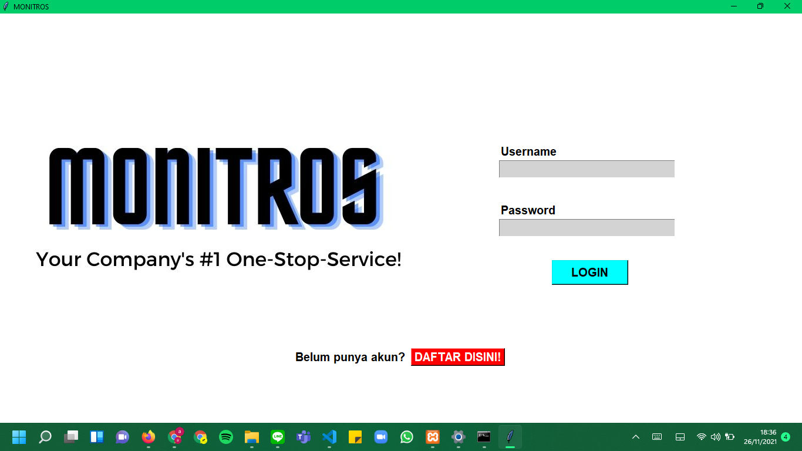
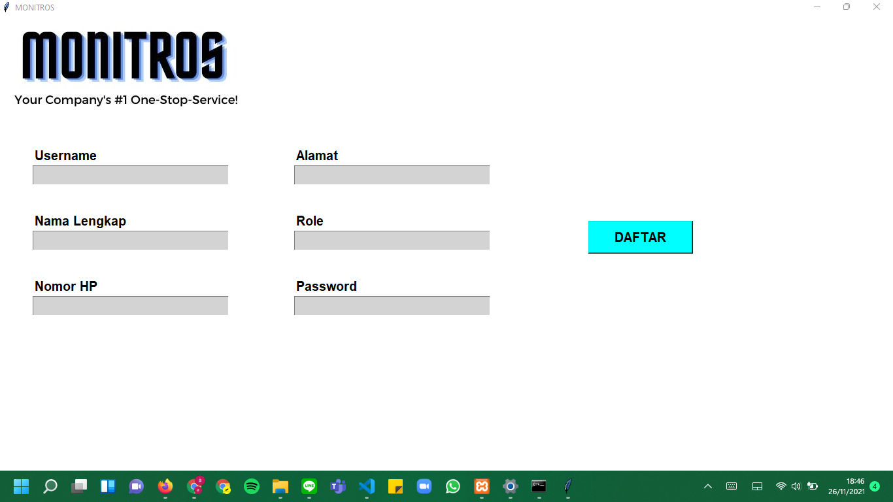
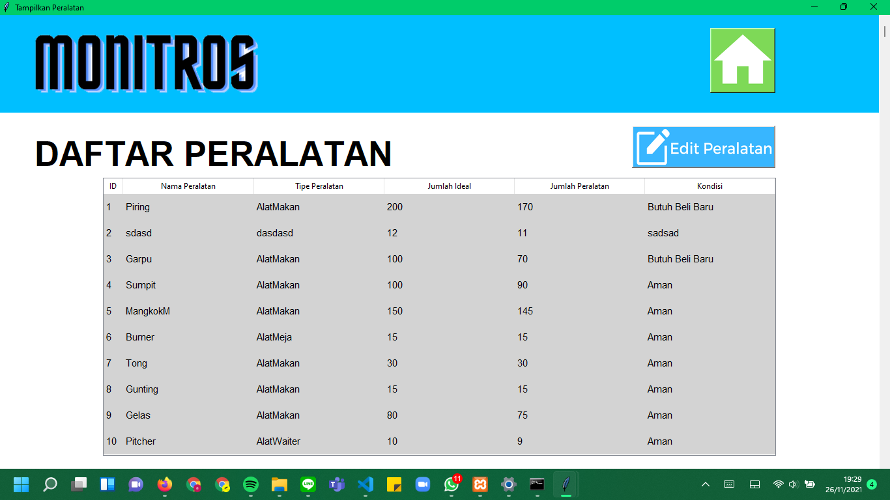
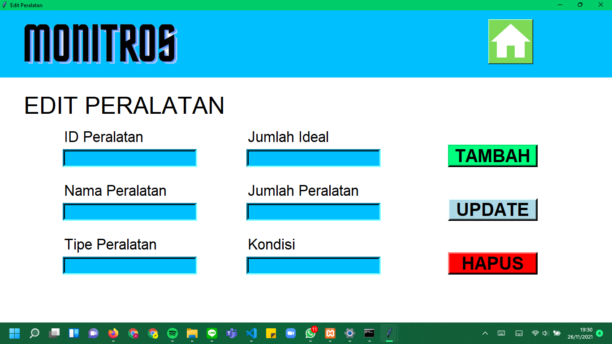
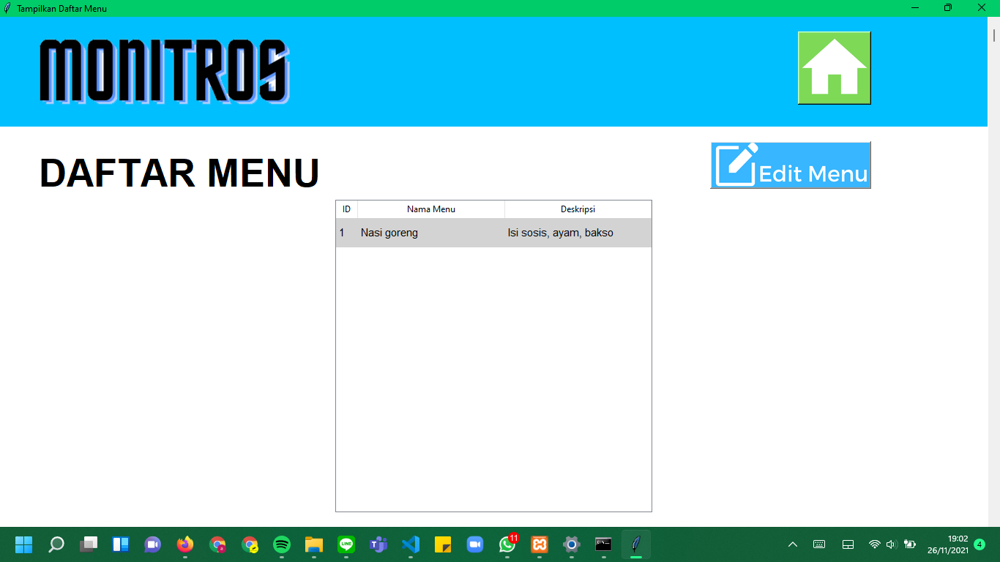
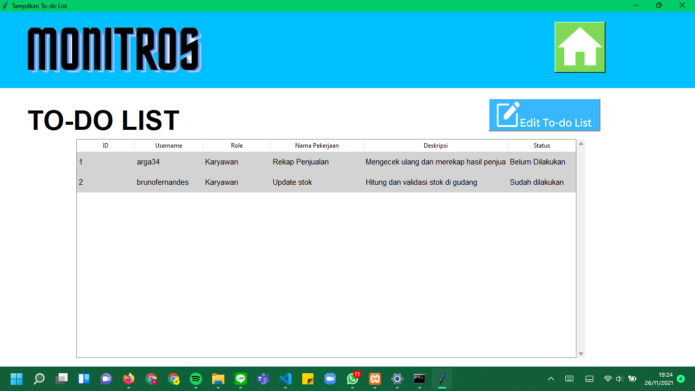
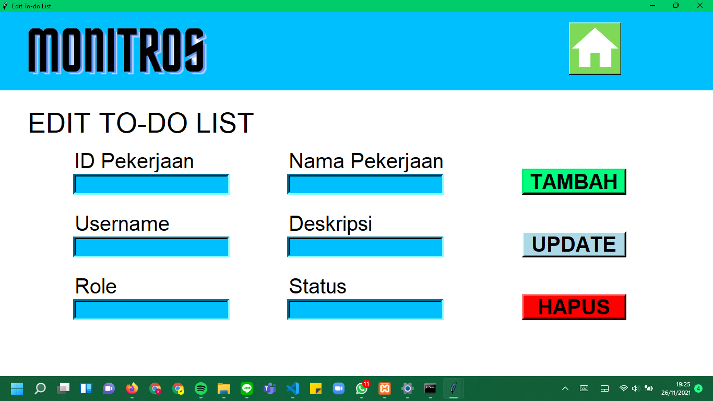

# IF3152-2021-G01-MONITROS

# PENJELASAN SINGKAT
Aplikasi 'MONITROS' adalah sebuah aplikasi manajemen sistem di restoran HeySteak Pekanbaru, yang memiliki 3 fitur utama:
- DAFTAR MENU (Termasuk dengan Edit Menu)
- DAFTAR PERALATAN (Termasuk dengan Edit Peralatan)
- TO-DO LIST (Termasuk dengan Edit To-do List). 

# CARA MENJALANKAN APLIKASI
- Buka directory 'src' dari folder yang telah diunduh dari repository if3152-2021-g01-monitros.
- Jalankan 'start.py' untuk menjalankan aplikasi.

# DAFTAR MODUL YANG DIIMPLEMENTASI
## LOGIN/REGISTER
Penanggung Jawab: Rahmat Fabhian Aminuddin

NIM: 18219055

## DAFTAR/EDIT PERALATAN
Penanggung Jawab: Kevin Kencana

NIM: 18219050

## DAFTAR/EDIT MENU
Penanggung Jawab: Fadli Naufal Rahman

NIM: 18219043

## LOGIN/REGISTER
Penanggung Jawab: Aindrea Rayhan Supriatno

NIM: 18219034

# DAFTAR TABEL BASIS DATA
Daftar tabel basis data yang diimplementasi dilengkapi dengan nama tabel dan atributnya
